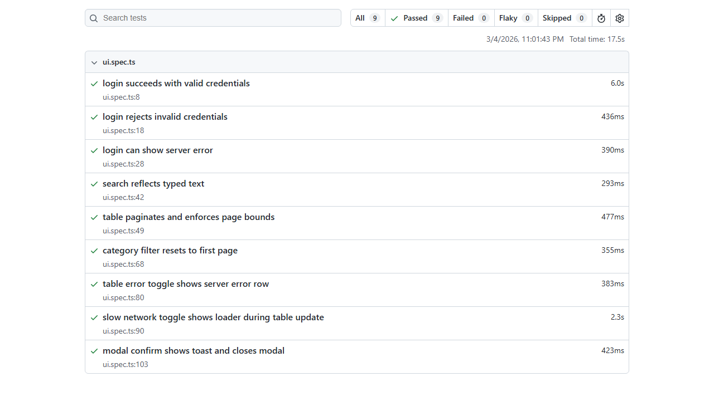

# Aliaksandr QA Lab Sandbox

A small QA sandbox using **Playwright** + **GitHub Actions**.

## What this project includes
- End-to-end Playwright tests running locally and in CI
- CI installs Playwright browsers
- HTML report and test artifacts uploaded from CI runs

## Live site
https://aliaksandrhv.github.io/aliaksandr-qa-lab-sandbox/

## Test scenarios
- Login success
- Invalid credentials validation
- Server error handling (flaky login toggle)
- Product search input behavior
- Pagination logic and bounds
- Category filtering
- Modal interaction and toast confirmation
- Slow network loader behavior
- API error handling for table data

## Simulated bugs/toggles in app
- Flaky login (`bug-flaky-login`)
- Case-sensitive search (`bug-case-sensitive-search`)
- Pagination off-by-one (`bug-offbyone-pagination`)
- Slow network delay (`bug-slow-network`)
- Table API error (`bug-table-error`)

## Playwright report screenshot

## Test runtime setup
- Playwright runs against a local web server via `webServer` config.
- `baseURL`: `http://127.0.0.1:3000`
- Server command: `npm run start`

## Run locally (Windows / PowerShell)
1) Install dependencies:
   - `npm ci`

2) Install Playwright browsers:
   - `npx playwright install`

3) Run tests:
   - `npx playwright test`

4) Open HTML report:
   - `npx playwright show-report`

## CI
Workflow: `.github/workflows/playwright.yml`

On every push to `main`, CI runs the Playwright suite and uploads:
- `playwright-report/` (HTML report)
- `test-results/` (screenshots/traces on failure)
